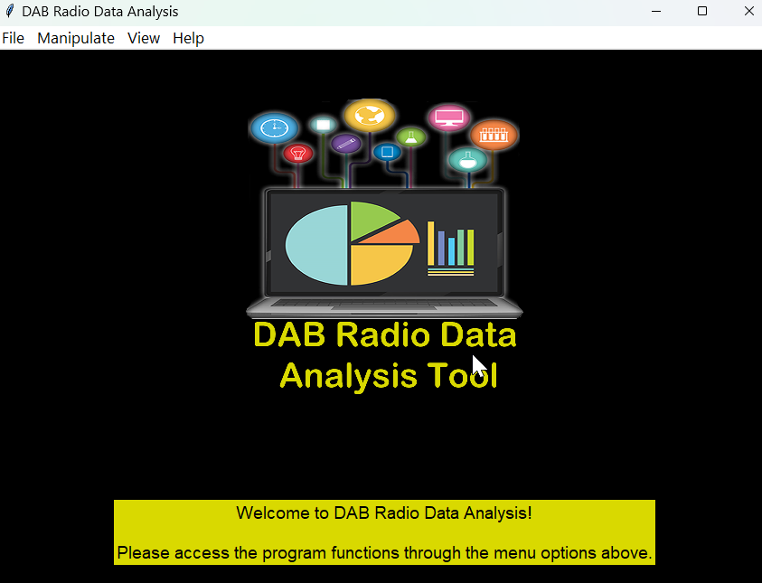
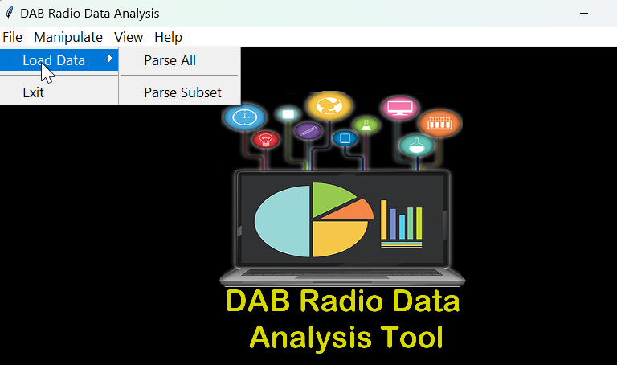
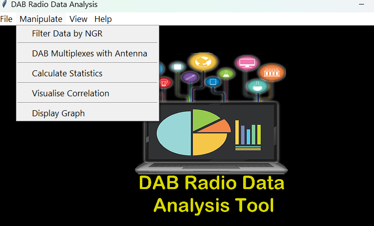

# DAB-DataAnalysis
DAB Radio Data Analysis project is a Data Science and Advanced programming project I  worked on during one of the modules of my master's program.  The project involved designing a Python GUI application with a PostgreSQL backend.

## Content
- Features
- Package Overview
- ScreenShots
- Technologies and Frameworks

## Features
- Importing data files
- Data Cleaning
- Parsing CSV
- Data Analysis using advanced SQL queries
- Visualising data

## Screenshots

