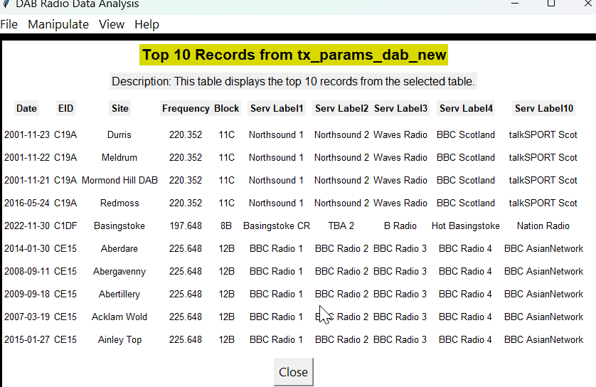
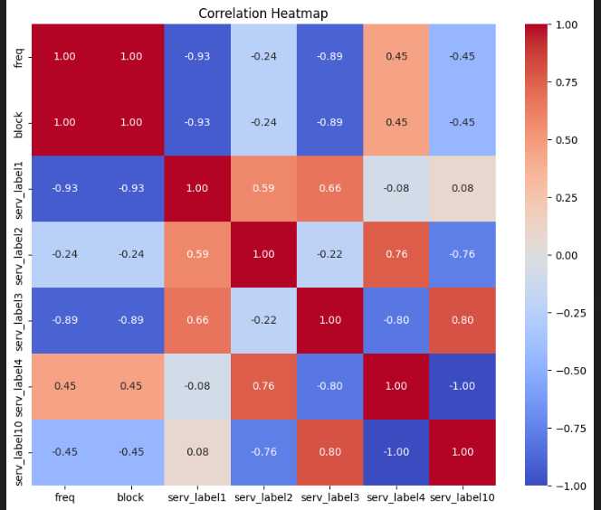
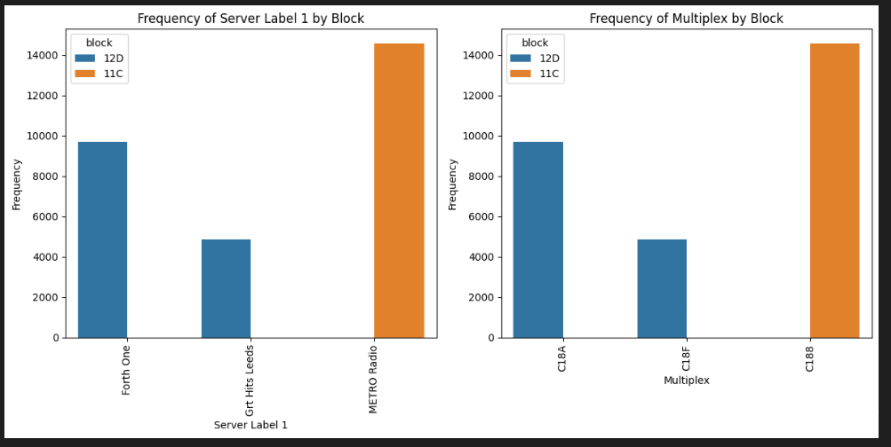

# DAB-DataAnalysis
DAB Radio Data Analysis project is a Data Science and Advanced programming project I  worked on during one of the modules of my master's program.  The project involved designing a Python GUI application with a PostgreSQL backend.

## Content
- Features
- Package Overview
- ScreenShots
- Technologies and Frameworks
## Installation Instructions
1. Make sure PostgreSQL 15.3 and above is installed.  It can be downloaded from [here](https://www.enterprisedb.com/downloads/postgres-postgresql-downloads)
2. Run the application using the [Jupyter notebook](./dabRadioDataAnalysisApp.ipynb) file 
3. There are two data files which can be parsed:

    a. [TxAntennaDAB.csv](./TxAntennaDAB.csv) |  b. [TxParamsDAD.csv](./TxParamsDAB.csv)

## Features
- Importing data files
- Data Cleaning
- Parsing CSV
- Data Analysis using advanced SQL queries
- Visualising data

## Screenshots

